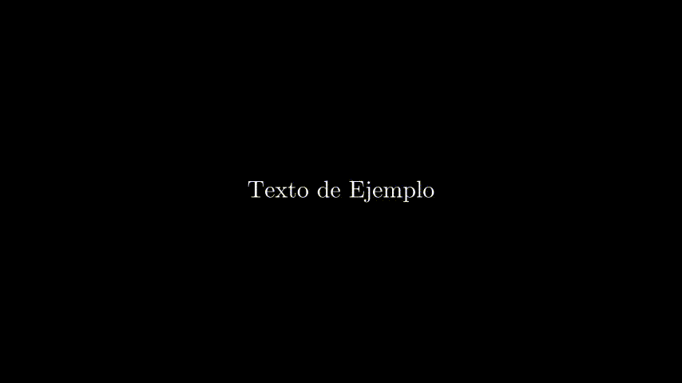

# [Manim](https://docs.manim.community)
## Que es Manim
Manim es una herramienta gratuita de animación para Python creada por Grant Sanderson, matemático de Stantford y dueño del canal de YouTube 3Blue1Brown.  
Está especializada en temas científicos, principalmente de carácter matemático, por lo que está basada en comandos de LaTeX (principalmente en TeX)

## Versiones
* [**manim gl**](https://github.com/3b1b/manim)	: (manim+opengl) most recent version created by Grant Sanderson(3blue1brown). allows rendering the video in real time
* [**manim ce**](https://github.com/ManimCommunity/manim)	: (manim+community) supported by a community.work with pycairo but a version with opengl will be available sortly.much more documentation
* **manim cairo**	: (manim+pycairo) old version. It stopped updating

## Instalación
1. Dependencias

	```bash
	$ sudo apt install libcairo2-dev
	$ sudo apt install libpango1.0-dev
	$ sudo apt install ffmpeg
	$ sudo apt install texlive texlive-latex-extra texlive-fonts-extra  texlive-latex-recommended texlive-science texlive-fonts-extra tipa
	$ sudo apt install python3-pip
	```

2. manim ce (manim+community)

	```bash
	$ pip3 install manim
	```

## flags

```
-p	: previewing. Pre-visualizamos el video cuando termina de renderizar
-ql 	: renerizado rapido y de baja calidad
-s 	: to skip to the end and just show the final frame.
-n 	: number to skip ahead to the nth animation of a scene.
-f 	: show the file in the file browser.
```

## Ejemplos
1. texto

	```bash
	$ vim scene.py
	```

	```py
	from manim import *
	class WriteText(Scene):
	    def construct(self):
		text=TextMobject("Texto de Ejemplo")
		self.add(text)
		self.wait(1)
		self.remove(text)
		self.wait(1)
	```

	```bash
	$ manim scene.py WriteText -pql
	```

	

2. circulo

	```bash
	$ vim scene.py
	```

	```py
	from manim import *
	class Circulo(Scene):
	    def construct(self):
		circle = Circle()                   # create a circle
		circle.set_fill(PINK, opacity=0.5)  # set the color and transparency
		self.play(ShowCreation(circle))     # show the circle on screen
	```

	```bash
	$ manim scene.py Circulo -pql
	```

	

3. cuadrado a circulo

	```bash
	$ vim scene.py
	```

	```py
	from manim import *
	class SquareToCircle(Scene):
	    def construct(self):
		circle = Circle()                    # create a circle
		circle.set_fill(PINK, opacity=0.5)   # set color and transparency

		square = Square()                    # create a square
		square.flip(RIGHT)                   # flip horizontally
		square.rotate(-3 * TAU / 8)          # rotate a certain amount

		self.play(ShowCreation(square))      # animate the creation of the square
		self.play(Transform(square, circle)) # interpolate the square into the circle
		self.play(FadeOut(square))           # fade out animation
	```

	```bash
	$ manim scene.py SquareToCircle -pql
	```

	
